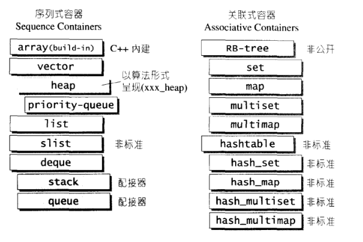

六大组件

1. 容器  - 序列式vector list deque  - set map multimap multiset hashtable
2. 算法：sort、search、copy、erase...
3. 迭代器：泛型指针，输入input、输出output、前向forward、双向bidirectional、随机访问random access
4. 仿函数：类似于函数，重载了operator（）
5. 配接器adapter：用来修饰容器、仿函数或者迭代器的接口。  如queue和stack
6. 配置器allocator：负责空间配置管理

相关头文件
\<iterator>
\<functional>
\<vector>
\<deque>
\<list>
\<queue>
\<stack>
\<set>
\<map>
\<algorithm>
\<numeric>
\<memory>
\<utility>
  