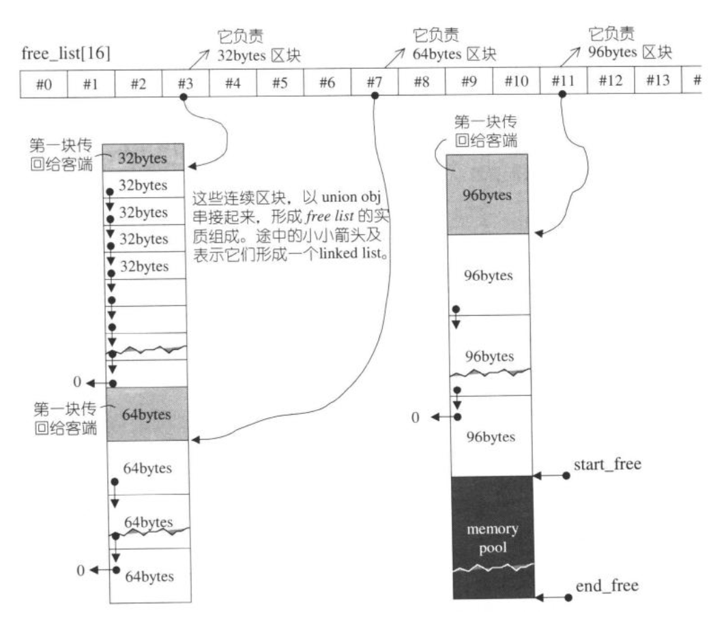

C++中 new() delete()对应 C语言中malloc和free

STL使用两级的allocator，目的是为了减少内存碎片问题
1. 第一级配置器，直接使用alloc和free
2. 第二级根据需求空间大小来决定，超过128bytes（足够大）直接用一级，否则用二级
二级适配器，使用memory pool的方式
其维护了16个自由链表（内存池），每个链表8,16,24...128byte大小的内存链表，结构类似于哈希表
1. 根据需要大小去内存池中拿
2. 若不足则去申请20个节点到内存池

结构图：

oom的处理，可以自己制定handle，否则一直等待释放内存，再去malloc
类似:

    while(1)
    {
        try malloc_handle();
        bool result = malloc();
        if(result) break;
    }
